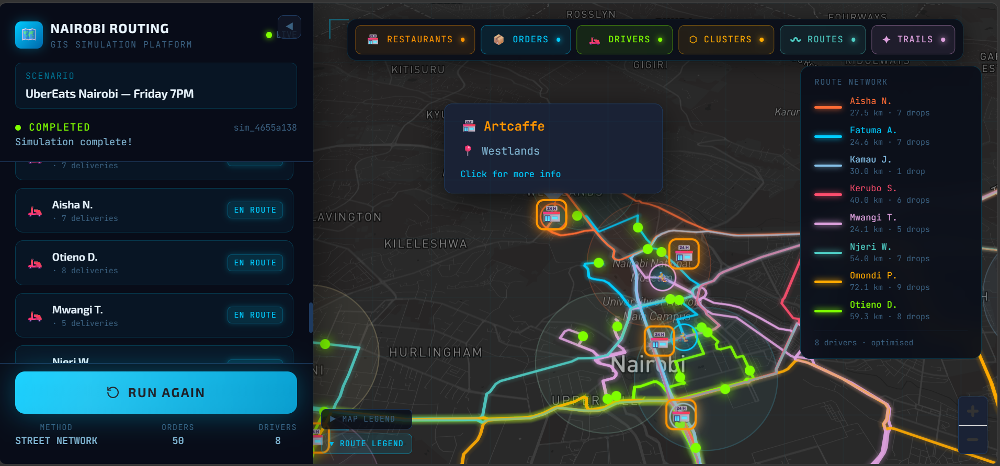
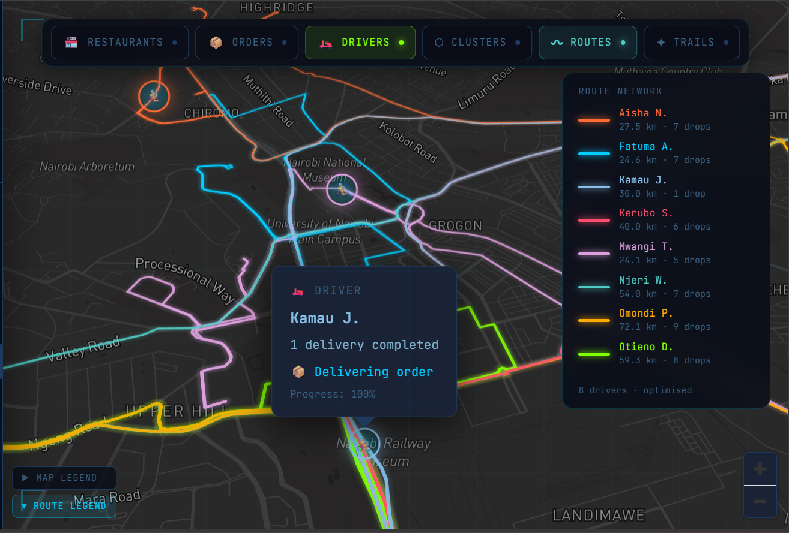
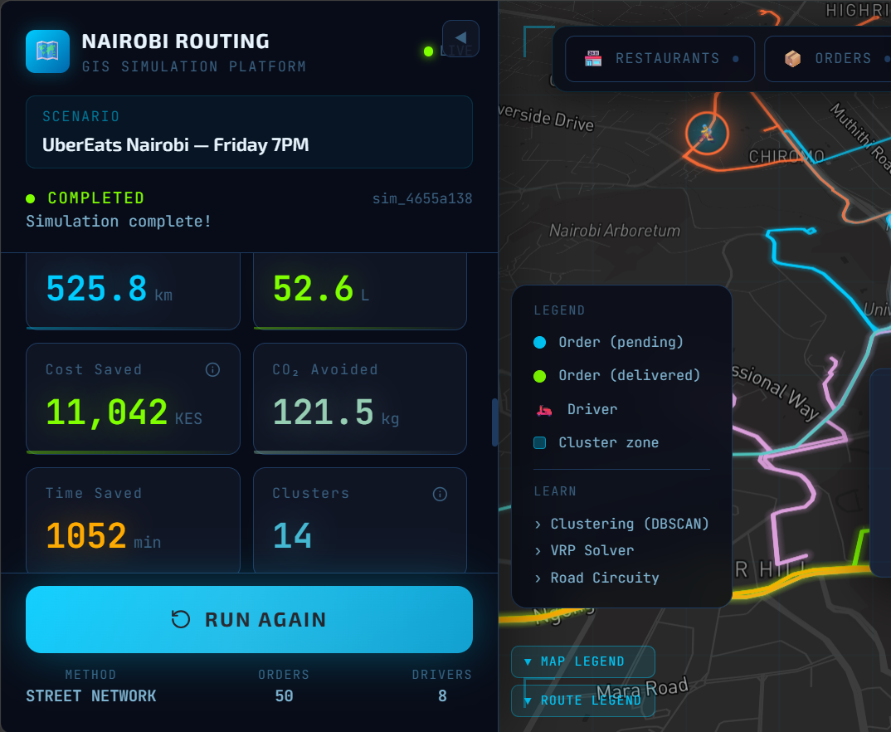
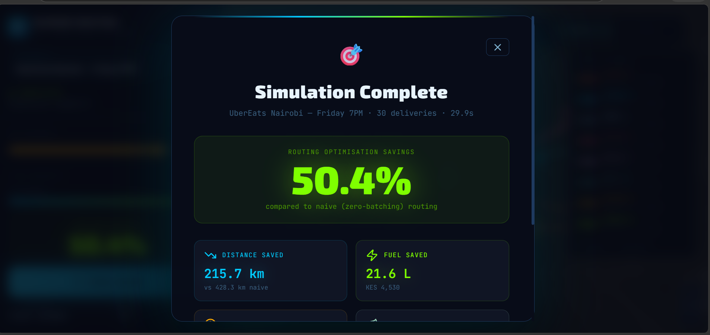
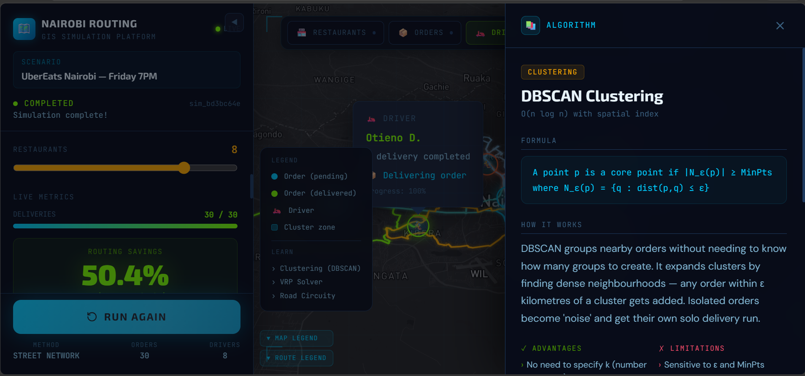

<div align="center">

# 🗺️ Smart Nairobi Delivery Routing

**An interactive GIS simulation platform demonstrating how spatial algorithms power real-world delivery logistics**

*Built to show how companies like Uber Eats, Bolt Food, and Glovo optimise thousands of daily deliveries across Nairobi*

[](https://nairobi-routing-frontend.vercel.app/)
[](https://github.com/Bettenoch/spatial_intelligence)
[](LICENSE)


</div>

---

## What This Project Does

Most GIS portfolios are Jupyter notebooks or static maps. This is neither.

This is a **live, interactive simulation platform** that lets you watch delivery route optimisation happen in real time across the actual streets of Nairobi. Configure the number of orders, drivers, and restaurants, hit **Simulate**, and the platform:

1. Generates realistic delivery orders weighted across real Nairobi neighbourhoods — CBD, Westlands, Kilimani, Karen, Rongai, and more
2. Clusters nearby orders using **DBSCAN** spatial clustering — the same algorithm used in production logistics systems
3. Assigns drivers to clusters and computes optimal routes using your chosen method
4. Animates drivers moving along real Nairobi roads in real time via WebSocket streaming
5. Calculates live savings — kilometres saved, fuel cost in KES, CO₂ avoided — compared to naive one-order-per-trip routing

Switch routing methods mid-setup and watch the map change. Open the **Learning Drawer** on any algorithm to see its formula, time complexity, pros/cons, and why it matters for Nairobi logistics specifically.

---

## Screenshots

**Full simulation in progress — orders clustered, drivers routed, metrics live**



**DBSCAN clustering — colour-coded zones form automatically around nearby orders**


**Route animation — drivers follow real Nairobi streets via OSRM**



**Metrics panel — live savings update with each completed delivery**



**Completion overlay — final summary with total savings and delivery stats**



**Learning drawer — algorithm explanations with formulas and Nairobi context**



---

## The Core Problem: Why Delivery Routing Is Hard

A naive delivery system sends one driver per order — a separate round trip every time. With 30 orders across Nairobi on a Friday evening, that's roughly **210 km** of driving.

Smart routing clusters nearby orders so one driver handles multiple deliveries in a single run. The result with the same 30 orders: **~130 km** — a **38% reduction** in distance, directly translating to fuel savings and faster delivery times.

The algorithms that make this work are what this project teaches.

---

## Architecture

This repository is the **React + TypeScript frontend**. The Python/FastAPI backend lives at [spatial_intelligence](https://github.com/Bettenoch/spatial_intelligence).

```
┌─────────────────────────────┐       ┌─────────────────────────────────────┐
│        React Frontend        │       │          FastAPI Backend              │
│         (Vercel)            │       │              (VPS / RackNerd)        │
│                             │       │                                       │
│  NairobiMap (Mapbox GL JS)  │◄─────►│  POST /api/simulate                  │
│  Sidebar + MetricsPanel     │  REST │  GET  /api/algorithms/{id}            │
│  LearningDrawer             │       │  GET  /api/concepts/{id}              │
│  Zustand state stores       │◄─────►│  WS   /ws/simulation/{session_id}    │
│                             │  WSS  │                                       │
└─────────────────────────────┘       │  OSMnx → Nairobi road graph          │
                                      │  DBSCAN / KMeans / HDBSCAN           │
                                      │  OSRM → real street routing          │
                                      │  OR-Tools → VRP optimisation         │
                                      └─────────────────────────────────────┘
```

### WebSocket Event Stream

Every simulation event streams from the backend in real time over a persistent WebSocket connection. The frontend maps each event to a specific UI action:

| Event | Frontend Response |
|---|---|
| `RESTAURANT_CREATED` | Restaurant pin appears on map |
| `ORDER_CREATED` | Animated pin drops on map, pending counter increments |
| `CLUSTER_FORMED` | Colour circle forms around cluster, pins recolour to match |
| `DRIVER_ASSIGNED` | Scooter icon appears, driver list entry updates |
| `ROUTE_COMPUTED` | Animated route line draws from driver through all stops |
| `DRIVER_MOVED` | Scooter moves along route with smooth interpolation |
| `DELIVERY_COMPLETED` | Pin turns green, delivery counter increments |
| `METRICS_UPDATED` | All savings numbers update live in sidebar |
| `SIMULATION_COMPLETED` | Summary overlay appears with final statistics |

---

## Spatial Algorithms Implemented

| Algorithm | Category | What It Does |
|---|---|---|
| **Euclidean Distance** | Distance | Straight-line baseline — demonstrates why naive routing fails |
| **Haversine Formula** | Distance | Great-circle distance accounting for Earth's curvature |
| **OSRM Routing** | Distance | Real road distances via OpenStreetMap — what production systems use |
| **DBSCAN** | Clustering | Density-based spatial clustering — no k required, handles noise points |
| **K-Means** | Clustering | Partition-based clustering when driver count is fixed |
| **HDBSCAN** | Clustering | Hierarchical DBSCAN — robust to varying density across city zones |
| **Dijkstra's Algorithm** | Routing | Classic shortest path on the road graph |
| **A\* Algorithm** | Routing | Heuristic shortest path — significantly faster than Dijkstra |
| **VRP (OR-Tools)** | Routing | Google OR-Tools Vehicle Routing Problem solver |

Every algorithm has a dedicated Learning Drawer entry explaining the formula, time complexity, pros/cons, and Nairobi-specific context.

---

## Tech Stack

| Layer | Technology | Rationale |
|---|---|---|
| Framework | React 18 + TypeScript + Vite | Type-safe, fast HMR, clean SPA for a client-side dashboard |
| Map engine | Mapbox GL JS v3 | GPU-rendered animated maps; native GL layers handle 60fps driver animation |
| State management | Zustand | Three focused stores — map, simulation, UI — with zero boilerplate |
| Styling | Tailwind CSS v3 | Utility-first dark theme with custom design tokens |
| Typography | Exo 2 + DM Sans + JetBrains Mono | Display / body / monospace — deliberately non-generic stack |
| Real-time | Native WebSocket API | Sub-10ms event latency; exponential backoff reconnection |

---

## Project Structure

```
nairobi_routing_frontend/
│
├── src/
│   ├── App.tsx                        # Root layout — map + panels + overlays
│   │
│   ├── components/
│   │   ├── map/
│   │   │   └── NairobiMap.tsx         # Mapbox GL canvas + all layer management
│   │   │
│   │   ├── sidebar/
│   │   │   ├── Sidebar.tsx            # Left panel container (collapsible)
│   │   │   ├── ScenarioHeader.tsx     # Brand header + simulation phase status
│   │   │   ├── MethodSelector.tsx     # Routing method selector + sliders
│   │   │   ├── MetricsPanel.tsx       # Live savings dashboard
│   │   │   ├── DriverList.tsx         # Active drivers with status badges
│   │   │   └── SimulateButton.tsx     # Main trigger + config summary
│   │   │
│   │   ├── learning/
│   │   │   └── LearningDrawer.tsx     # Slides in from right — algorithm explanations
│   │   │
│   │   └── ui/
│   │       ├── CompletionOverlay.tsx  # Final stats modal
│   │       ├── MapHUD.tsx             # Top-center live counter bar
│   │       └── LoadingOverlay.tsx     # Graph loading screen
│   │
│   ├── hooks/
│   │   ├── useSimulation.ts           # WebSocket lifecycle + event dispatching
│   │   └── useAlgorithmInfo.ts        # Algorithm content fetcher
│   │
│   ├── store/
│   │   ├── simulationStore.ts         # Orders, drivers, routes, clusters, metrics
│   │   ├── mapStore.ts                # Driver positions, trails, restaurant markers
│   │   └── uiStore.ts                 # Drawer state, completion overlay
│   │
│   ├── services/
│   │   ├── api.ts                     # REST client
│   │   └── websocket.ts               # WebSocket class with reconnection
│   │
│   ├── constants/
│   │   └── mapConfig.ts               # Viewport, colours, routing method configs
│   │
│   └── types/
│       └── index.ts                   # All shared TypeScript types
│
├── public/
│   └── screenshots/                   # App screenshots for README
│
├── .env.local.example
├── vite.config.ts
├── tailwind.config.js
└── package.json
```

---

## Getting Started

### Prerequisites

- Node.js 18+
- A free [Mapbox account](https://account.mapbox.com/) for the map token
- The [backend](https://github.com/Bettenoch/spatial_intelligence) running locally or on a server

### 1. Clone the repository

```bash
git clone https://github.com/Bettenoch/nairobi_routing_frontend.git
cd nairobi_routing_frontend
```

### 2. Install dependencies

```bash
npm install
```

### 3. Configure environment variables

```bash
cp .env.local.example .env.local
```

Open `.env.local` and set your values:

```env
# Free token at https://account.mapbox.com → Account → Tokens
VITE_MAPBOX_TOKEN=pk.eyJ1IjoieW91cnVzZXJuYW1lIiwiYSI6InlvdXJ0b2tlbiJ9.your_token_here

# Point to wherever your backend is running
VITE_API_URL=http://localhost:8000
VITE_WS_URL=ws://localhost:8000
```

### 4. Start the backend

```bash
# Clone and set up the backend first
git clone https://github.com/Bettenoch/spatial_intelligence.git
cd spatial_intelligence

# First run downloads the Nairobi road graph (~30s). Cached on subsequent runs.
uvicorn app.main:app --reload --port 8000
```

### 5. Start the frontend

```bash
npm run dev
# → http://localhost:3000
```

The Vite dev server proxies `/api` and `/ws` to `localhost:8000` automatically — no CORS config needed locally.

---

## Production Deployment

### Frontend → Vercel

```bash
npm run build
```

Deploy to Vercel and set these environment variables in the project dashboard:

```
VITE_MAPBOX_TOKEN  =  pk.eyJ...
VITE_API_URL       =  https://your-backend-domain.com
VITE_WS_URL        =  wss://your-backend-domain.com
```

Use `wss://` (WebSocket Secure) in production — required when the frontend is served over HTTPS.

### Backend → VPS

Full deployment instructions including Docker Compose, Nginx reverse proxy, and SSL are in the [backend repository](https://github.com/Bettenoch/spatial_intelligence).

---

## Key Design Decisions

**Why Mapbox GL JS over Leaflet?**
Mapbox GL renders on the GPU using WebGL. Animating 30+ driver icons simultaneously, route lines drawing in, and cluster circles appearing — all at 60fps — requires GPU rendering. Leaflet's SVG/Canvas approach drops frames at this event rate.

**Why Zustand over Redux?**
Three decoupled consumers share state: the map layers, the sidebar metrics, and the learning drawer. Zustand handles this cleanly with three focused stores and no boilerplate.

**Why WebSockets over polling?**
The simulation streams up to 10 events per second during animation phases. WebSocket gives sub-10ms latency per event, which is what makes the map feel live rather than jerky.

**Why DBSCAN over K-Means for clustering?**
K-Means requires specifying k upfront. DBSCAN discovers cluster boundaries from the data itself, handles isolated orders as natural solo trips, and works correctly with Nairobi's elongated order distributions along road corridors like Waiyaki Way and Ngong Road.

---

## Key GIS Concepts Demonstrated

**UTM Projection for accurate clustering.** DBSCAN measures distance in metres. Running it on raw WGS84 lat/lon produces incorrect clusters because 1° of longitude ≠ 1° of latitude near the equator. The backend projects to UTM Zone 37S (EPSG:32737) — the correct coordinate system for Nairobi — before clustering.

**Road circuity.** Nairobi's average circuity factor is ~1.4×, reaching 1.8× in the CBD. A delivery that looks 3 km away can be 5+ km by road, flipping the optimal driver assignment. This is why Haversine alone is insufficient for real dispatch decisions.

**The Vehicle Routing Problem.** Given N orders and K drivers, find the minimum-cost assignment and route ordering. NP-hard in general. OR-Tools uses Guided Local Search and Simulated Annealing to find near-optimal solutions in seconds — the same solver used by logistics platforms worldwide.

---

## Author

**Bett Enoch**
GIS Developer · Nairobi, Kenya

[](https://bett-xp.vercel.app/)
[](https://www.linkedin.com/in/bettenoch/)
[](https://github.com/Bettenoch)

---

## Related Repository

The backend (FastAPI, OSMnx, DBSCAN, OSRM, OR-Tools, Docker) lives here:
**[spatial_intelligence](https://github.com/Bettenoch/spatial_intelligence)**

Live demo: **[nairobi-routing-frontend.vercel.app](https://nairobi-routing-frontend.vercel.app/)**

---

## License

MIT License — see [LICENSE](LICENSE) for details.

---

<div align="center">
  <sub>Built with real OpenStreetMap data · Nairobi road network © OpenStreetMap contributors</sub>
</div>